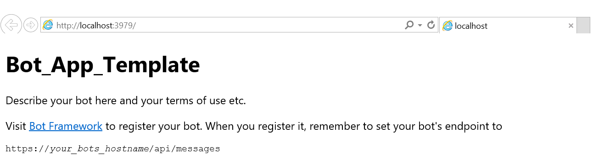

# Lab:  Building your first bot with a Dialog in .NET

## Pre-requisites
1.	Visual Studio 2015 (Community version is ok) (could use Visual Studio Code on non-Windows systems – however most these instructions are working from Visual Studio) - download [here](https://beta.visualstudio.com/downloads/)
2.	A Microsoft Account to log into the Bot Framework developer portal, which you will use to register your Bot as well as to sign up for Cognitive Services subscriptions (if you have Hotmail, Live, Outlook.com, or an Xbox account then you already have a Microsoft Account).
4.	The Bot Framework Emulator from the Bot Framework [Downloads](https://docs.botframework.com/en-us/downloads/#navtitle) page.
5.	The Bot Framework Visual Studio Template (C#) from the Bot Framework [Downloads](https://docs.botframework.com/en-us/downloads/#navtitle) page.
6.	(Optional) Github for Windows (comes with Git Shell) or git on other systems to download this repository.
7.	(Optional) An Azure account for an Azure-accessible REST endpoint (for registering your bot with the Bot Framework service)
7.	(Optional) Developer accounts on one or more communication services (such as Facebook) where your Bot will communicate (Skype is already set up for you).
8.	(Optional) An Azure App Insights account to capture telemetry on your bot. 

## If developing in Node.js and the Node.js Bot Builder SDK

Download Node.js Tools for Visual Studio (https://www.visualstudio.com/en-us/features/node-js-vs.aspx) (may need VS 2015 Update 3 - https://www.visualstudio.com/en-us/news/releasenotes/vs2015-update3-vs ) - if developing in Node

## Getting started
### EchoBot and Dialogs

Adapted from https://docs.botframework.com/en-us/csharp/builder/sdkreference/dialogs.html

### A Simple EchoBot

From Bot Framework .NET template, perform the following steps to add Dialog functionality.
Add this namespace:

`using Microsoft.Bot.Builder.Dialogs;`

Add this class:

```
    [Serializable]
    public class SimpleDialog : IDialog
    {
        public async Task StartAsync(IDialogContext context)
        {
            context.Wait(ActivityReceivedAsync);
        }

        public async Task ActivityReceivedAsync(IDialogContext context, IAwaitable<object> result)
        {
            var activity = await result as Activity;

            String text = activity.Text;
            if (text.Contains("/"))
            {
                String[] stringTokens = text.Split('/');
                if(stringTokens.Length==2)
                {
                    int intScore = 0;
                    if(int.TryParse(stringTokens[0], out intScore))
                    {
                        if(intScore > 300)
                            await context.PostAsync("We are definitely going to win");
                        else if (intScore > 200)
                            await context.PostAsync("We are making good progress");
                        else if (intScore > 100)
                            await context.PostAsync("We are making progress");
                        else if (intScore > 50)
                            await context.PostAsync("We are playing OK");
                    }
                }
            }

            context.Wait(ActivityReceivedAsync);
        }
    }
```

Replace the Post method with this one:

```
        public virtual async Task<HttpResponseMessage> Post([FromBody] Activity activity)
        {
            // check if activity is of type message
            if (activity != null && activity.GetActivityType() == ActivityTypes.Message)
            {
                await Conversation.SendAsync(activity, () => new SimpleDialog());
            }
            else
            {
                HandleSystemMessage(activity);
            }
            var response = Request.CreateResponse(HttpStatusCode.OK);
            return response;
        }

```

Run from VS


This should open a browser window with the endpoint (showing the default.htm file from project) and the port should match the port in the emulator.


