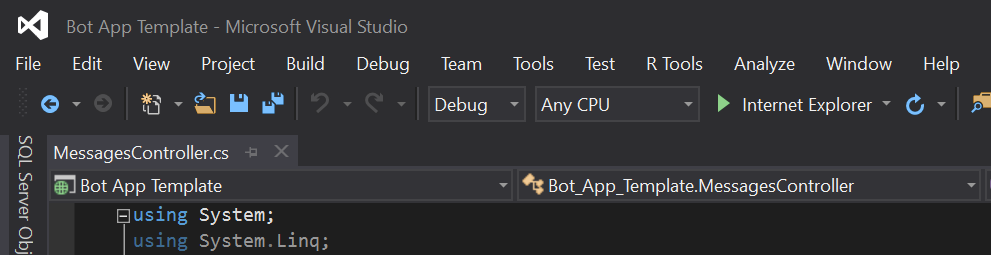
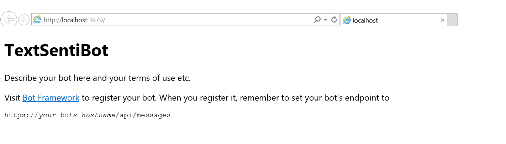
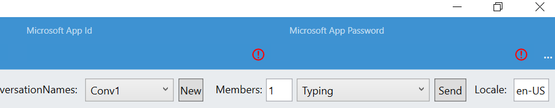

# Lab:  A Sentiment Analysis Bot in .NET

## Pre-requisites

**Note:  If you have already satisfied the pre-requisites, please move ahead to [TextSentiBot](#textsentibot) below.**

1.	Visual Studio 2015 (Community version is ok) (could use Visual Studio Code on non-Windows systems – however most these instructions are working within a Windows system)
2.	A Microsoft Account to log into the Bot Framework developer portal, which you will use to register your Bot as well as to sign up for Cognitive Services subscriptions (if you have Hotmail, Live, Outlook.com, or an Xbox account then you already have a Microsoft Account).
3.	An Azure account for an Azure-accessible REST endpoint (for registering your bot with the Bot Framework service)
4.	The Bot Framework Emulator from the Bot Framework [Downloads](https://docs.botframework.com/en-us/downloads/#navtitle) page.
5.	The Bot Framework Visual Studio Template (C#) from the Bot Framework [Downloads](https://docs.botframework.com/en-us/downloads/#navtitle) page.
6.	Github for Windows (comes with Git Shell)
7.	(Optional) Developer accounts on one or more communication services (such as Facebook) where your Bot will communicate (Skype is already set up for you).
8.	(Optional) An Azure App Insights account to capture telemetry on your bot. 

## If developing in Node.js and the Node.js Bot Builder SDK

Download Node.js Tools for Visual Studio (https://www.visualstudio.com/en-us/features/node-js-vs.aspx) (may need VS 2015 Update 3 - https://www.visualstudio.com/en-us/news/releasenotes/vs2015-update3-vs ) - if developing in Node

### TextSentiBot

> Adapted from https://docs.botframework.com/en-us/bot-intelligence/language/#example-emotional-bot

**From Bot Framework .NET template, perform the following steps to add the Text Analytics Cognitive Services API call.**

**Create a new C# class file (Sentiment.cs) with the following code.** The class will serve as our model for the JSON input/output of the Text Analytics API.

```csharp

namespace TextSentiBot
{
    // Classes to store the input for the sentiment API call
    public class BatchInput
    {
        public List<DocumentInput> documents { get; set; }
    }
    public class DocumentInput
    {
        public double id { get; set; }
        public string text { get; set; }
    }

    // Classes to store the result from the sentiment analysis
    public class BatchResult
    {
        public List<DocumentResult> documents { get; set; }
    }
    public class DocumentResult
    {
        public double score { get; set; }
        public string id { get; set; }
    }

}
```

**Next, go to *MessagesController.cs* and add the following namespaces if needed.**

```csharp
using System;
using System.Linq;
using System.Net;
using System.Net.Http;
using System.Threading.Tasks;
using System.Web.Http;
using System.Web.Http.Description;
using Microsoft.Bot.Connector;
using Newtonsoft.Json;
using System.Collections.Generic;
using System.Net.Http.Headers;
using System.Text;
```

The code receives the user message, calls the sentiment analysis endpoint and responds accordingly to the user.  **Replace the Post method in *MessageController.cs* with the following code.**


```csharp
        public async Task<HttpResponseMessage> Post([FromBody]Activity activity)
        {
            ConnectorClient connector = new ConnectorClient(new Uri(activity.ServiceUrl));

            if (activity == null || activity.GetActivityType() != ActivityTypes.Message)
            {
                //add code to handle errors, or non-messaging activities
            }

            const string apiKey = "2562e5c336844e37a93db20fc0a00367";
            string queryUri = "https://westus.api.cognitive.microsoft.com/text/analytics/v2.0/sentiment";

            HttpClient client = new HttpClient();
            client.DefaultRequestHeaders.Add("Ocp-Apim-Subscription-Key", apiKey);
            client.DefaultRequestHeaders.Add("Accept", "application/json");
            BatchInput sentimentInput = new BatchInput();

            sentimentInput.documents = new List<DocumentInput>();
            sentimentInput.documents.Add(new DocumentInput()
            {
                id = 1,
                text = activity.Text
            });

            var sentimentJsonInput = JsonConvert.SerializeObject(sentimentInput);
            byte[] byteData = Encoding.UTF8.GetBytes(sentimentJsonInput);
            var content = new ByteArrayContent(byteData);
            content.Headers.ContentType = new MediaTypeHeaderValue("application/json");
            var sentimentPost = await client.PostAsync(queryUri, content);
            var sentimentRawResponse = await sentimentPost.Content.ReadAsStringAsync();
            var sentimentJsonResponse = JsonConvert.DeserializeObject<BatchResult>(sentimentRawResponse);
            double sentimentScore = sentimentJsonResponse.documents[0].score;

            var replyMessage = activity.CreateReply();
            replyMessage.Recipient = activity.From;
            replyMessage.Type = ActivityTypes.Message;

            if (sentimentScore > 0.9)
            {
                replyMessage.Text = $"This appears quite positive to me.";
            }
            else if (sentimentScore < 0.1)
            {
                replyMessage.Text = $"This appears quite negative to me.";
            }
            else
            {
                replyMessage.Text = $"I can not decipher the sentiment here.  Please try again or add more information.";
            }

            await connector.Conversations.ReplyToActivityAsync(replyMessage);
            var response = Request.CreateResponse(HttpStatusCode.OK);
            return response;
        }
```

**Run from VS**
 


This should open a browser window with the endpoint (showing the default.htm file from project) and the port should match the port in the emulator.



**Open the Bot Framework Emulator application.**  

For local testing with the emulator make sure the Id and password fields are clear:
 



**Test out this bot in the emulator.**


**Now, feel free to register and publish your bot to try out on Skype or your favorite channel.**
